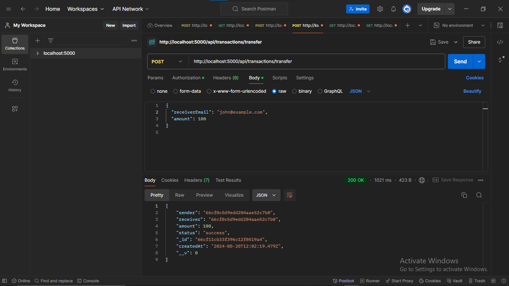
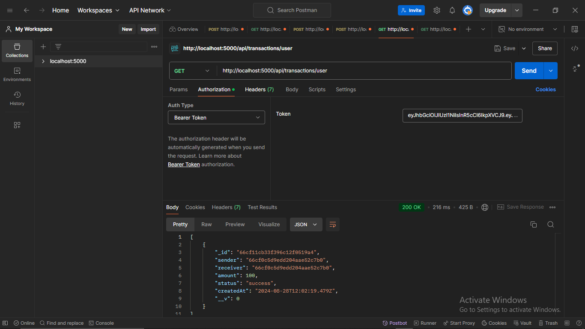

# Wallet APP

Postman Documentation URL: [https://documenter.getpostman.com/view/36572624/2sA3kPp4UP](https://documenter.getpostman.com/view/36572624/2sA3kPp4UP) .

## Installation

1. Clone the repository:

    ```bash
    git clone https://github.com/raj-1106/Wallet
    ```
2. Navigate to the project directory:

    ```bash
    cd Wallet
    ```

3. Install the dependencies:

    ```bash
    npm install
    ```

4. Set up environment variables:

    Create a `.env` file in the root directory and add the following variables:

    ```bash
    PORT=5000
    MONGO_URI=your_mongodb_uri
    JWT_SECRET=your_jwt_secret
    ```

5. Start the server:

    ```bash
    npm start
    ```

    The server should be running on `http://localhost:5000`.

### Postman Collection

- User Registeration
 <br>
    <p align="center">
      
    </p>
  <br>

- User Verify
 <br>
    <p align="center">
      
    </p>
  <br>

- User Login
 <br>
    <p align="center">
      
    </p>
  <br>

- Transfer
 <br>
    <p align="center">
      
    </p>
  <br>

- Transaction
 <br>
    <p align="center">
      
    </p>
  <br>

- All Transaction
 <br>
    <p align="center">
      
    </p>
  <br>
